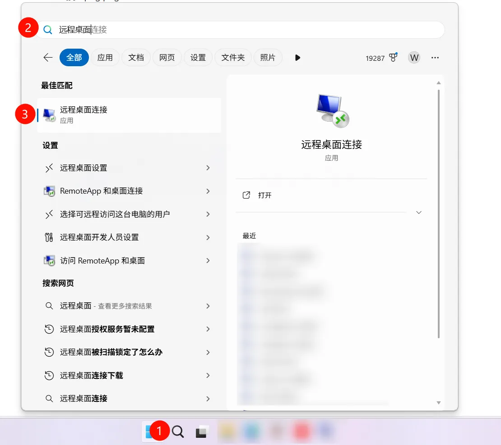

# 远程管理服务器  
> 分为`Windows`、`Linux`两部分   
> By 清蒸云鸭    

## Windows 管理  

> **使用软件：**   
> 电脑连接：远程桌面连接 / RemoteDesktop   
> 手机连接：微软远程桌面 / WindowsApp （不详细赘述自行查阅）  

### 一、远程连接服务器  
1. 按下`Win`+`S`打开搜索，输入`远程桌面连接`，并打开  
 

2. 复制你的服务器**远程连接地址**(一般由`IP:端口`组成，独立IP默认端口只需填写IP)    

3. 点击`连接`后，将会提示你输入凭据，这时点击下方`更多选项`，点击`使用其他账户`    

4. 输入 **用户名** 和 **密码** (一般云服务器默认用户名为`Administrator`)    

5. 点击确认，即可连接到服务器远程桌面！   

### 二、开启/关闭/重启 服务端  
> Waiting for adding.  

## Linux 管理  

> **使用软件：**   
> 电脑连接：Tabby Terminal / FinalShell / Xshell+XFtp  
> 手机连接：Termius  

> Waiting for adding.  

