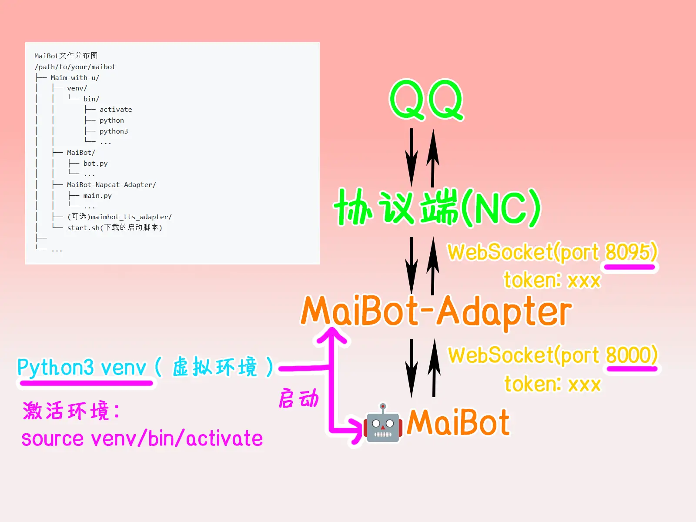

# MaiBot配置与启动  

## MaiBot的架构图
```
# MaiBot文件分布图
/path/to/your/maibot
├── maimai/
│   ├── venv/
│   │   └── bin/
│   │       ├── activate
│   │       ├── python
│   │       ├── python3
│   │       └── ...
│   ├── MaiBot/
│   │   ├── bot.py
│   │   └── ...
│   ├── MaiBot-Napcat-Adapter/
│   │   ├── main.py
│   │   └── ...
│   ├── (可选)maimbot_tts_adapter/
│   └── start.sh(下载的启动脚本)
├── 
└── ...
```

```
# MaiBot应用间通信图  
MaiBot  
↑↓ # default port:8000  
(可选:MaiBotTTSAdapter)  
↑↓
MaiBot-NapCat-Adapter(Websocket Server)
↑↓ # default port: 8095
↑↓ # token: xxx (default: None)
NapCat(WebSocket Client)
```



## 初次启动

::: tip 忘记怎么激活虚拟环境？  
在maimai目录下执行：  
```bash
source venv/bin/activate
```
:::

首次启动MaiBot将会生成默认的配置文件  

```bash
# 在maimai目录下执行  
cd MaiBot

# 执行两次，会自动创建配置文件
python3 bot.py
python3 bot.py
```

## 配置麦麦本体(MaiBot)  

::: tip 如何编辑文件  
方式一： FinalShell或其他支持sftp的工具直接双击编辑  
方式二： 使用nano或vim，新手推荐nano: `nano 文件名`  
**nano如何保存与退出**:  
Ctrl+S: 保存  
Ctrl+X: 退出  
:::  

### 配置WebUI网页控制台  
新版本MaiBot WebUI主机默认绑定在`127.0.0.1`即本机，无法通过外部访问  
如果你无法访问MaiBot-WebUI，请将以下`WEBUI_HOST`改为`0.0.0.0`  

::: details 1. 本体环境配置`MaiM-with-u/MaiBot/.env`
```toml
# 麦麦主程序配置
HOST=127.0.0.1
PORT=8000

# WebUI 独立服务器配置
WEBUI_ENABLED=true
WEBUI_MODE=production
WEBUI_HOST=0.0.0.0      # WebUI 服务器监听地址，这就是我们要改的
WEBUI_PORT=8001         # WebUI 服务器端口
```  
:::

### (可选)手动配置模型提供商  

::: tip  
新版本中已经能在WEBUI中管理模型配置和机器人配置，可以直接跳过  
:::  

麦麦对硅基流动的适配性非常良好  

::: info 注册硅基流动  
你可以通过这个链接来注册：
https://cloud.siliconflow.cn/i/ys2vPqSO  
注册完成后
1. 完成`实名认证`   
2. 找到`API密钥`->`新建API密钥`  
3. 填入描述信息（任意）->`复制密钥`  
4. 得到**API-KEY**
:::

在文件中的`api_key = "your-silicon-flow-api-key"`填入得到的硅基流动**API-KEY**密钥  
::: details 模型配置`config/model_config.toml`  
```
[inner]
version = "1.8.2"

[[api_providers]]
name = "DeepSeek"
base_url = "https://api.deepseek.com/v1"
api_key = "your-api-key-here"
client_type = "openai"
max_retry = 2
timeout = 120
retry_interval = 10

[[api_providers]]
name = "BaiLian"
base_url = "https://dashscope.aliyuncs.com/compatible-mode/v1"
api_key = "your-bailian-key"
client_type = "openai"
max_retry = 2
timeout = 120
retry_interval = 5

[[api_providers]]
name = "Google"
base_url = "https://generativelanguage.googleapis.com/v1beta"
api_key = "your-google-api-key-1"
client_type = "gemini"
max_retry = 2
timeout = 120
retry_interval = 10

[[api_providers]]
name = "SiliconFlow"
base_url = "https://api.siliconflow.cn/v1"
api_key = "your-silicon-flow-api-key"
client_type = "openai"
max_retry = 3
timeout = 120
retry_interval = 5
```
:::

### (请在WEBUI配置)配置机器人配置  
这里包含了一些人格设置  

## 配置麦麦适配器(MaiBot-Napcat-Adapter)  
::: info  
麦麦适配器是MaiBot与Napcat通信的中间程序  
:::  

下面跟着我配置吧！  
首先，需要处于`maimai/`目录下，如果你在`MaiBot`目录，使用`cd ..`返回上级目录  
```bash
# 如果你在`MaiBot`目录下请执行：
cd ..

# 进入MaiBot-Napcat-Adapter目录
cd MaiBot-Napcat-Adapter/

# 在虚拟环境下首次启动Napcat-Adapter，生成默认配置
python3 main.py
```

### 配置`config.toml`  
在以下文件中，配置
1. `napcat_server` - `token`  
2. `chat` - `group_list` / `private_list`  

::: details `config.toml`  
```
[inner]
version = "0.1.2" # 版本号
# 请勿修改版本号，除非你知道自己在做什么

[nickname] # 现在没用
nickname = ""

[napcat_server] # Napcat连接的ws服务设置
host = "localhost"      # Napcat设定的主机地址
port = 8095             # Napcat设定的端口 
token = ""              # Napcat设定的访问令牌，若无则留空
heartbeat_interval = 30 # 与Napcat设置的心跳相同（按秒计）

[maibot_server] # 连接麦麦的ws服务设置
host = "localhost" # 麦麦在.env文件中设置的主机地址，即HOST字段
port = 8000        # 麦麦在.env文件中设置的端口，即PORT字段

[chat] # 黑白名单功能
group_list_type = "whitelist" # 群组名单类型，可选为：whitelist, blacklist
group_list = [12345678,2345678]               # 群组名单
# 当group_list_type为whitelist时，只有群组名单中的群组可以聊天
# 当group_list_type为blacklist时，群组名单中的任何群组无法聊天
private_list_type = "whitelist" # 私聊名单类型，可选为：whitelist, blacklist
private_list = [12345678,2345678]               # 私聊名单
# 当private_list_type为whitelist时，只有私聊名单中的用户可以聊天
# 当private_list_type为blacklist时，私聊名单中的任何用户无法聊天
ban_user_id = []   # 全局禁止名单（全局禁止名单中的用户无法进行任何聊天）
ban_qq_bot = false # 是否屏蔽QQ官方机器人
enable_poke = true # 是否启用戳一戳功能

[voice] # 发送语音设置
use_tts = false # 是否使用tts语音（请确保你配置了tts并有对应的adapter）

[debug]
level = "INFO" # 日志等级（DEBUG, INFO, WARNING, ERROR, CRITICAL）
```
:::


## 启动程序  
::: warning  
在正式启动麦麦之前，请先手动启动一次程序确保没有报错，再按Ctrl+C退出  
:::  

### 手动启动一次  
分别到 `maimai/MaiBot` 和 `maimai/MaiBot-Napcat-Adapter` 目录下执行：

请先确保现在处于`maimai/`文件夹下，并且已经 **激活虚拟环境**  

::: tip 忘记怎么激活虚拟环境？  
在maimai目录下执行：  
```bash
source venv/bin/activate
```
:::

```bash
# 启动本体  
cd MaiBot/
python3 bot.py  

# 这里启动完本体后需要同意用户协议，输入`同意`或`confirmed`即可

# 启动Napcat适配器  
cd ../MaiBot-Napcat-Adapter/  
python3 main.py  
```

确认无误后，按下`Ctrl+C`退出，并转到下方，使用启动脚本来运行  
脚本将会使用screen，**以免退出ssh后后端掉线**  

### 下载启动脚本  
GitHub开源地址：https://github.com/WhiteCloudOL/Qbot-StartScripts  

#### 手动下载  
前往[github](https://github.com/WhiteCloudOL/Qbot-StartScripts)下载  
如果无法访问可通过[夸克网盘](https://pan.quark.cn/s/2abd298d1fb6)下载  
下载完成后上传到 `maimai/`文件夹下即可  

#### 脚本下载
请确认处于`maimai/`目录下  
```bash
# 请确保你在MaiBot和MaiBot-Napcat-Adapter文件夹的同级目录
# 海外服务器直接下载
wget https://raw.githubusercontent.com/WhiteCloudOL/Qbot-StartScripts/refs/heads/main/MaiBot-Start-Script.sh

# 国内1加速下载
wget "https://gh-proxy.org/https://raw.githubusercontent.com/WhiteCloudOL/Qbot-StartScripts/refs/heads/main/MaiBot-Start-Script.sh"

# 国内2加速下载
wget "https://hk.gh-proxy.org/https://raw.githubusercontent.com/WhiteCloudOL/Qbot-StartScripts/refs/heads/main/MaiBot-Start-Script.sh"
```

### 脚本启动麦麦  
通过脚本启动不需要激活虚拟环境，直接运行脚本输入对应编号即可运行  
请确认处于`maimai/`目录下  
```bash
# 运行脚本
bash MaiBot-Start-Script.sh
```
此时按下: `1`，即可帮助我们打开`MaiBot`和`Napcat-Adapter`  

## 访问WebUI

::: tip 无法访问WebUI?   
请修改[配置](#配置webui网页控制台)~
:::  

#### 1. 独立IP服务器  
确保先防火墙关闭（例如装有宝塔面板）  
部分云服务商设有防火墙，需前往对应服务器管理界面开放`8001`(TCP)端口  
直接访问：`http://<你的服务器IP>:8001`  

#### 2. NAT云服务器（共享IP）  
请在云服务器NAT管理界面转发`内网: 8001`到`外网: 任意端口`
此时访问：`http://<你的服务器IP>:<外网端口>`即可访问  

#### 获取访问密钥  
FinalShell文件管理找到`MaiBot/data/webui.json`
复制
```json
"access_token":  "xxxxxxxxx"  
```
对应的`xxxxxxxxx`即可  

或使用命令：
```bash
# 如果没有安装jq
apt install -y jq

# 在maimai/MaiBot/data 目录下
jq -r '.access_token' webui.json
```
直接得到`access_token`