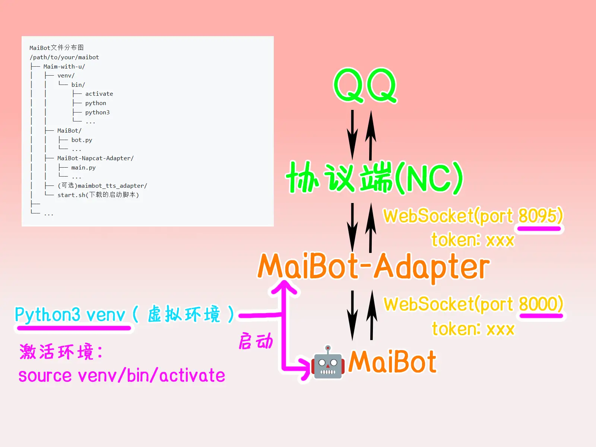
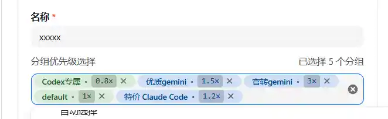
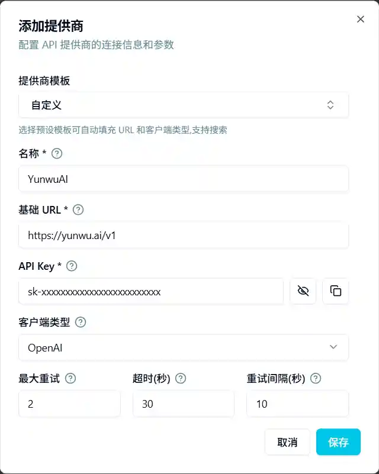
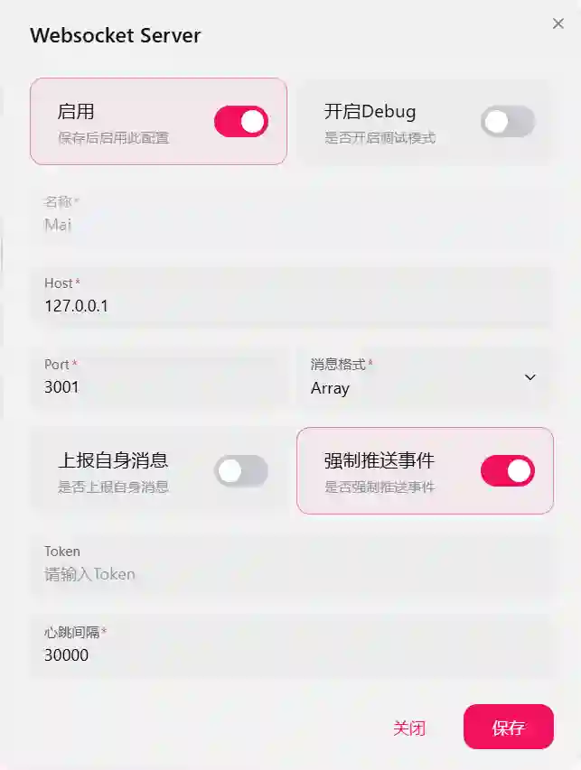

# MaiBot配置与启动  

::: warning 文档升级提示  
为适应新版本MaiBot,本页文档正在调整中，可能有不周到之处，感谢理解喵~  
:::  

## MaiBot的架构图
```
# MaiBot文件分布图
maimai/
│   ├── Napcat/
│   │   ├── config/
│   │   ├── docker-compose.yml
│   │   └── ...
│   ├── MaiBot/
│   │   ├── .venv/ (UV虚拟环境)
│   │   ├── bot.py
│   │   ├── plugins/
│   │   │   ├── MaiBot-Napcat-Adapter/
│   │   │   └── ...
│   │   └── ...
│   ├── (可选)maimbot_tts_adapter/
│   └── start.sh(下载的启动脚本)
├── 
└── ...
```

```
# MaiBot应用间通信图  
MaiBot  
↑↓ # default port:8000  
(可选:MaiBotTTSAdapter)  
↑↓
MaiBot-NapCat-Adapter(Websocket Client)
↑↓ # default port: 3001
↑↓ # token: xxx (默认为空)
NapCat(WebSocket Server)
```

<!--  -->

## 初次启动

首次启动MaiBot将会生成默认的配置文件  

```bash
# 在maimai目录下执行  
cd MaiBot

# 如果崩溃请重启，启动完成后需输入"confirm"或"同意"以同意用户协议
uv run bot.py
```

## 配置麦麦WebUI网页控制台  

* 若你使用一键脚本，请前往脚本`配置与访问`->`初始化MaiBot访问配置`完成更改，无需手动配置  

::: tip 如何编辑文件  
方式一： FinalShell/Tabby或其他支持sftp的工具直接双击编辑  
方式二： 使用nano或vim，新手推荐nano: `nano 文件名`  
**nano如何保存与退出**:  
Ctrl+S: 保存  
Ctrl+X: 退出  
:::  
  
MaiBot WebUI主机默认绑定在`127.0.0.1`即本机，无法通过外部访问  
如果你无法访问MaiBot-WebUI，请找到以下`webui.host`改为`0.0.0.0`  

::: details Bot配置`maimai/MaiBot/config/bot_config.toml`
```toml
[webui]
enabled = true # 是否启用WebUI
host = "0.0.0.0" # <-- WebUI 绑定主机地址，这就是我们需要改的
port = 8001 # WebUI 绑定端口
mode = "production" # 运行模式：development(开发) 或 production(生产)
anti_crawler_mode = "basic" # 防爬虫模式：false(禁用) / strict(严格) / loose(宽松) / basic(基础-只记录不阻止)
allowed_ips = "127.0.0.1" # IP白名单（逗号分隔，支持精确IP、CIDR格式和通配符）
trusted_proxies = "" # 信任的代理IP列表（逗号分隔），只有来自这些IP的X-Forwarded-For才被信任
trust_xff = false # 是否启用X-Forwarded-For代理解析（默认false）
secure_cookie = false # 是否启用安全Cookie（仅通过HTTPS传输，默认false）
enable_paragraph_content = false # 是否在知识图谱中加载段落完整内容（需要加载embedding store，会占用额外内存）
```  
:::


## 配置模型提供商  

### 添加模型提供商  
麦麦兼容OpenAI与Google格式的不同服务提供商，WebUI内置了不同模板可切换，以下为推荐的API提供商  

::: info (更强大的模型能力)配置云雾AI  
通过这个链接注册：https://yunwu.ai/register?aff=6Fas  
注册完成后：  
1. 进入`控制台`->`API令牌`  
2. 选择`添加令牌`  
3. 输入任意名称，`分组优先级`选择下勾选你需要的渠道分组（推荐顺序`Codex专属`->`优质gemini`->`官转gemini`->`default`->`特价Claude Code`）  
4. 设置`额度`，可选无限，确保不要泄露密钥  
5. 确定并回到`API令牌`界面，复制创建的API密钥(格式为sk开头，例如`sk-4kLu**********TxC3`)  
6. 回到MaiBot网页控制台->`AI模型厂商配置`  
7. 选择`添加提供商`，提供商模板为`自定义`  
8. 填入信息：
```
名称: YunwuAI  
基础 URL: https://yunwu.ai/v1
API Key: sk-***********
```
1. 保存  
:::  

具体设置参照：  
::: details 云雾AI设置图  
1. 分组设置  
  

2. 麦麦配置
  
:::  

::: info (稳定推荐，仅限国产模型)配置硅基流动API  
你可以通过这个链接来注册：  
https://cloud.siliconflow.cn/i/ys2vPqSO  
注册完成后：
1. 完成`实名认证`   
2. 找到`API密钥`->`新建API密钥`  
3. 填入描述信息（任意）->`复制密钥`   
4. 得到**API-KEY**  
5. 回到MaiBot网页控制台->`AI模型厂商配置`  
6. 选择`添加提供商`，提供商模板为`硅基流动`  
7. 填入信息：
```
名称: SiliconFlow  
API Key: sk-***********
```
1. 保存  
:::  

* **手动配置**：编辑文件`maimai/MaiBot/config/model_config.toml`
:::

## 配置麦麦人格、表达设置  
这里包含了一些人格设置  

## 配置麦麦适配器(MaiBot-Napcat-Adapter)  
::: info  
新版本的适配器已经改为插件形式，不过原有独立形式获取也可以使用(?)  
:::  

下面跟着我配置吧！  
1. 首先，需要处于`MaiBot`目录下，如果你在`maimai`目录，使用`cd MaiBot`进入MaiBot目录  

```bash
# 如果你在`maimai`目录下请执行：
cd MaiBot

# 进入MaiBot-Napcat-Adapter目录，如果这里报错证明你没有安装MaiBot-Napcat-Adapter插件，请跳转到本文档MaiBot部署页安装
cd plugins/MaiBot-Napcat-Adapter
```

2. 修改插件配置文件`maimai/MaiBot/plugins/MaiBot-Napcat-Adapter/config.toml`  
::: tip 没有找到此文件？  
请先启动一次MaiBot并同意用户许可协议  
:::  
使用nano编辑或下载到本地编辑：
```bash  
# 如果选择nano编辑，修改完成后按下Ctrl+S保存，按下Ctrl+X退出  
nano config.toml
```  

3. 修改配置，启用适配器插件  
在配置文件中找到:

```toml
[plugin]
enabled = false
```

将其中的`false`改为`true`，并保存  

4. 修改配置，添加白名单  
在配置文件中找到:
```toml
[chat]
enable_chat_list_filter = true
show_dropped_chat_list_messages = false
group_list_type = "whitelist"
group_list = [13456890,123456789]
private_list_type = "whitelist"
private_list = [12345678,23456789]
ban_user_id = []
ban_qq_bot = false
```
修改其中的`group_list`与`private_list`，填入需要的群号与QQ号即可  


## 启动程序  
::: warning  
在正式启动麦麦之前，请先手动启动一次程序确保没有报错，再按Ctrl+C退出  
:::  

### 手动启动一次  
分别到 `maimai/MaiBot` 和 `maimai/MaiBot-Napcat-Adapter` 目录下执行：  
:::

```bash
# 启动本体  
cd MaiBot/
uv run bot.py
# 这里启动完本体后需要同意用户协议，输入`同意`或`confirmed`即可
```

确认无误后，按下`Ctrl+C`退出，并转到下方，使用启动脚本来运行  
脚本将会使用screen，**以免退出ssh后后端掉线**  

### 下载启动脚本  

::: warning 升级提示  
脚本已更新支持MaiBot `v1.0.0` 喵~
:::

GitHub开源地址：https://github.com/WhiteCloudOL/Qbot-StartScripts  

#### 手动下载  
前往[github](https://github.com/WhiteCloudOL/Qbot-StartScripts)下载  
如果无法访问可通过[夸克网盘](https://pan.quark.cn/s/2abd298d1fb6)下载  
下载完成后上传到 `maimai/`文件夹下即可  

#### 脚本下载
请确认处于`maimai/`目录下  
```bash
# 请确保你在MaiBot和MaiBot-Napcat-Adapter文件夹的同级目录
# 海外服务器直接下载
wget https://raw.githubusercontent.com/WhiteCloudOL/Qbot-StartScripts/refs/heads/main/MaiBot-Start-Script.sh

# 国内1加速下载
wget "https://gh-proxy.org/https://raw.githubusercontent.com/WhiteCloudOL/Qbot-StartScripts/refs/heads/main/MaiBot-Start-Script.sh"

# 国内2加速下载
wget "https://hk.gh-proxy.org/https://raw.githubusercontent.com/WhiteCloudOL/Qbot-StartScripts/refs/heads/main/MaiBot-Start-Script.sh"
```

### 脚本启动麦麦  
通过脚本启动不需要激活虚拟环境，直接运行脚本输入对应编号即可运行  
请确认处于`maimai/`目录下  
```bash  
# 运行脚本  
bash MaiBot-Start-Script.sh  
```
此时按下: `1`，即可帮助我们打开`MaiBot`  
新版本MaiBot-Napcat-Adapter已集成于主程序插件中，无需另外启动喵~

## 访问WebUI

::: tip 无法访问WebUI?   
请修改[配置](#配置麦麦webui网页控制台)~
:::  

#### 1. 独立IP服务器  
确保先防火墙关闭（例如装有宝塔面板）  
部分云服务商设有防火墙，需前往对应服务器管理界面开放`8001`(TCP)端口  
直接访问：`http://<你的服务器IP>:8001`  

#### 2. NAT云服务器（共享IP）  
请在云服务器NAT管理界面转发`内网: 8001`到`外网: 任意端口`
此时访问：`http://<你的服务器IP>:<外网端口>`即可访问  

#### 获取访问密钥  
FinalShell文件管理找到`MaiBot/data/webui.json`
复制
```json
"access_token":  "xxxxxxxxx"  
```
对应的`xxxxxxxxx`即可  

或使用命令：
```bash
# 如果没有安装jq
apt install -y jq

# 在maimai/MaiBot/data 目录下
jq -r '.access_token' webui.json
```
直接得到`access_token`

## 配置NapCat协议端  

::: tip 安装Napcat  
按照[此步骤](../napcat.md#docker一键安装)安装  
如提示未找到docker请执行步骤内上文的脚本安装docker  
:::  

安装完成NapCat后进入Napcat控制台  

* 选择`网络配置`  
* `新建`->`WebSocket 服务端`  
* URL填入`ws://localhost:8095`  
* Token改为你在`MaiBot/plugins/MaiBot-Napcat-Adapter/config.toml`里设置的`napcat_server`->`token`，默认为空，Napcat与Adapter两者token配置需要一致
* 勾选启用，并确定  

  


为了防止部分bug，建议重启一次MaiBot  
现在你就完成了Napcat的配置了！不出意外，你的Bot已经能够正确接收消息~  