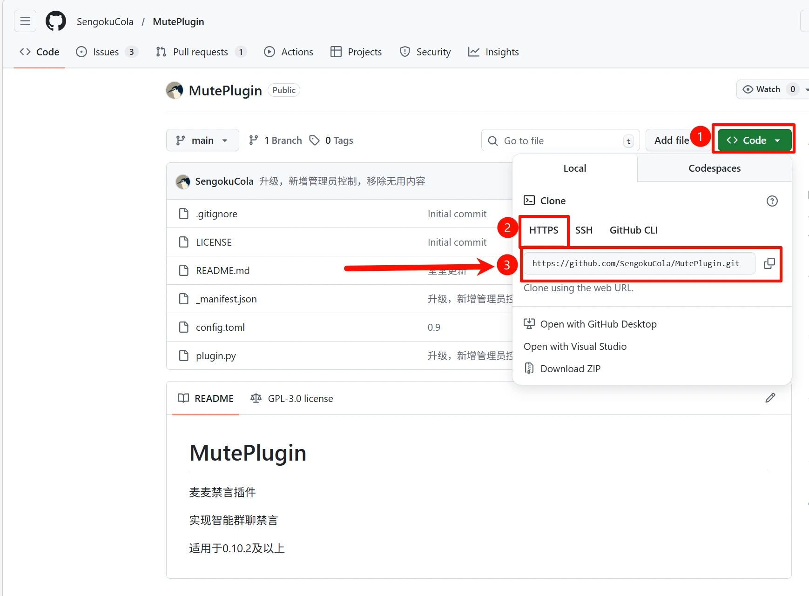

# MaiBot插件安装与配置

## 插件安装目录

MaiBot的**插件安装目录**位于 `<你的麦麦安装目录>/MaiBot/plugins/` 文件夹下

## 如何安装插件

## 方式一：一键脚本安装(推荐)  
1. (方式1) 在MaiBot网页控制台中找到`插件市场`，找到你心仪的插件，点击`查看详情`，跳转到`仓库: Github`  
   (方式2) 打开[MaiBot插件市场](https://plugins.maibot.chat/)，找到你心仪的插件查看详情，并跳转到`Source Repo`  

2. 找到`<> Code`->`HTTPS`->复制仓库Git地址（例如：`https://github.com/SengokuCola/MutePlugin.git`）  
  

3. 运行脚本`bash maibot.sh`，选择`插件管理`->`安装插件`，填入插件仓库git地址，按照提示输入即可~  

### 方式二：手动安装  
1. (方式1) 在MaiBot网页控制台中找到`插件市场`，找到你心仪的插件，点击`查看详情`，跳转到`仓库: Github`  
   (方式2) 打开[MaiBot插件市场](https://plugins.maibot.chat/)，找到你心仪的插件查看详情，并跳转到`Source Repo`  
2. 找到`<> Code`->`HTTPS`->复制仓库Git地址（例如：`https://github.com/SengokuCola/MutePlugin.git`）  
  
3. (海外服务器跳过此步骤) 国内服务器需要将原始Git地址替换为GitHub加速地址  
```bash
# 可用加速地址(更多可见https://github.akams.cn/)：
https://gh-proxy.org/
https://hk.gh-proxy.org/
https://cdn.gh-proxy.org/
https://edgeone.gh-proxy.org/
https://gh.llkk.cc/
```

由以上Github加速地址+原始Git地址（例如：`https://github.com/SengokuCola/MutePlugin.git`），即可得到Github加速地址
`https://hk.gh-proxy.org/https://github.com/SengokuCola/MutePlugin.git`  
4. 进入**插件安装目录**，输入`git clone <插件的git地址>`即可（国内替换为加速地址），即可下载得到插件  
5. 输入`ls`，查看当前目录文件，使用`cd <文件夹名>`进入刚刚下载好的插件文件夹中  
```
root@RainYun-c3Srwn3w:~/test# git clone https://hk.gh-proxy.org/https://github.com/SengokuCola/MutePlugin.git
Cloning into 'MutePlugin'...
remote: Enumerating objects: 45, done.
remote: Counting objects: 100% (45/45), done.
remote: Compressing objects: 100% (29/29), done.
remote: Total 45 (delta 25), reused 31 (delta 14), pack-reused 0 (from 0)
Receiving objects: 100% (45/45), 28.99 KiB | 1.71 MiB/s, done.
Resolving deltas: 100% (25/25), done.
root@RainYun-c3Srwn3w:~/test# ls
MutePlugin
root@RainYun-c3Srwn3w:~/test# cd MutePlugin/
root@RainYun-c3Srwn3w:~/test/MutePlugin#
```

6. 安装插件依赖  

大部分插件都存在一个`requirements.txt`依赖需求文件，我们需要安装这些依赖  

```bash
# 当前所在 MaiBot/
uv pip install -r plugins/<某个具体的插件文件夹>/requirements.txt

# 示例：
uv pip install plugins/MutePlugin/requirements.txt
```

::: tip 不存在requirements.txt文件怎么办？  
有两种可能  
1. 插件不需要依赖，无需安装    
2. 插件需要依赖，但插件并不规范没有放置requirements.txt，一般在插件仓库可以找到依赖需求以及如何安装的说明   
:::

7. 重新启动MaiBot本体，即可看到插件生成的`config.toml`配置文件  
8. 使用`nano`或下载到本地来编辑插件配置文件  
```bash
# 当前所在 MaiBot/
nano plugins/<某个具体的插件文件夹>/config.toml
```

9. 重启MaiBot即可生效  


### 方式三：WebUI安装(不推荐)  

在MaiBot网页控制台中找到`插件市场`，找到你心仪的插件即可完成安装  

::: warning 安装失败？  
由于MaiBot-WebUI的一堆*史山*，使用MaiBot插件市场直接安装失败是非常正常的事情，因此推荐使用手动安装  
:::  