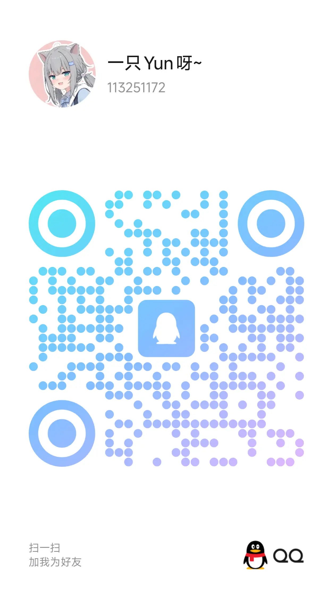

# 问题解决  
## Q&A
### 1. 安装服务端完成，在MCSM终端输入命令有反应，但客户端法找到服务器？（报错`Connection refused: no further Infornatlon`）  
 - 答：请检查：  
   (1) 服务端`server.properties`中`server-port`是否已经修改为云服务器提供的端口！   
   (2) 客户端输入的服务器地址是否正确  
### 2. 安装基础端，导入压缩包开服后，进入服务器报错MOD缺失？
 - 答：请确认你导入的压缩包是 **服务端**，如果不是，请更换为服务端   
### 3. 我如何导入自己的存档到服务器上？
 - 答：替换`文件管理`->`world/`文件夹，将里面的所有文件删除，用自己的存档导入替换  
   【[详见进阶](#1-更换地图)】  
### 4. 无法进入服务器: 暂时无法连接至验证服务器，请稍后再试
 - 答：请看视频[点击跳转](https://www.bilibili.com/video/BV16tejetEUH/)
### 5. 无法进入服务器：无效会话
 - 答：两个原因：  
   (1) 你使用的是离线登录（即所谓盗版），而服务器开启了正版验证，请关闭`online-mode`  
   (2) 你启动器登录的身份已经过期，尝试重新登录启动器  
### 6. 无法进入服务器：用户名错误  
 - 答：  
   (1) 用户名过长，请缩短用户名`Internal Exception: io.netty.handler.codec.DecoderException: The received string length is longer than Maximum allowed (XX > 16)`  
   (2) 用户名不合法，请使用英文、数字、下划线`A-Za-z0-9_`: `Invalid characters in usernare`  

### 7. 频繁因WatchDog崩溃  
 - 答：  
   (1) 检查日志是否有模组异常报错  
   (2) 服务器内刷线/刷怪 **异常过多**，请尝试清除所有实体`kill @e`  
   (3) 服务器**实体或加载过多** 无法支撑运行，此时你需要升级服务器配置  

### 8. 找不到启动脚本(run.sh/start.sh) 
 - 答:  
   (1) 检查上传的是否是**服务端**而非客户端  
   (2) 检查是否已经安装好核心（如没有可参照[视频教程](https://www.bilibili.com/video/BV1GTUhBfETs/)）  
   (3) 如已经安装好且确定为服务端，请按照此[步骤](install-mc.md#编辑启动脚本)**手动填写脚本**

## 无法解决问题？
::: tip 
如何找到报错日志？  
**崩溃后**，打开`MCSM面板`，单击`文件管理`，可以看到`logs`与`crash-report`  
`logs`文件夹内的`latest.log`与`crash-report`里最新的报错就是需要的报错日志
:::

### 一、AI咨询
附上`latest.log`/`报错日志`最后几段丢给任意AI应用，AI会帮助你总结并定位问题  

### 二、群聊寻求帮助  
询问报错问题请附上 `崩溃后的完整日志`，单纯给出一个截图一段文字无法定位问题！  
一般都能够回答，除非**无法沟通**  
**Q群：**[637174573](https://qm.qq.com/q/8xaxycHFKw)  
  

### 三、有偿远程解决问题  

1. Q群私聊群主  
2. QQ：[113251172](https://qm.qq.com/q/8xaxycHFKw)  
