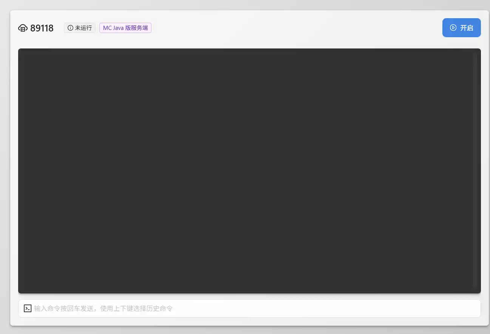

# 雨云MCSM面板  

> 最后更新：清蒸云鸭. 2025.11.21  
> 雨云MCSM面板文档  
> 雨云注册链接：https://www.rainyun.com/qzyy_  
> 使用优惠码 [ **qzyy** ] 可享受首月5折  


## 注册与登录雨云  
### 一、打开官网

1. 打开官网链接：https://www.rainyun.com/qzyy_  
2. 单击右上角 **注册/登录** 输入用户名和密码即可注册
3. 注册完成后 右上角 **头像** 处点击 **账户设置** 完成 **绑定微信** 和 **实名认证** 即可获得*首月5折券*


## 选购合适的服务器
### 1. 确认需求:
:smile_cat:请确保你需要服务器来服务联机，如果人数极少且不经常游玩，可选择使用 **内网穿透/虚拟局域网** 的方式来联机，此处推荐使用 **Sakura FRP** ，这类产品需要年满18周岁才可使用！   
如果你的确需要服务器，请继续往下看~  

::: warning  
此面板仅适用于Minecraft，饥荒，泰拉瑞亚，僵尸毁灭工程等游戏开服，且单面板仅能运行一个服务端，如果你单服多开需求，或挂载其他程序，请选择 **游戏云VPS** ，此类自由度会高很多！  
:::
### 2. 确认预算  
预算是一切购物的前提，请提前明确自己的预算以进行服务器的选配  
如果是短期需求以下可直接按照5折计算  
| 预算区间        |      服务器CPU选择      |  游戏性能 |
| :-------------: | :-----------: | :----: |
| 0-50      | E5/免费MCSM（积分商城2000兑换） | 差(仅建议原版) |
| 50-120      |   E5/8275CL/6146    |  较差 |
| 120-200 |   8275CL/6146/5900X/7950X    |  较好 |
| 200+  |  5900X/7950X/9950X/14900K | 好 |

### 3. 具体选配
如整合包MOD较少可在预算范围提高CPU档次，体验会好上不少  
如果经常在线，人比较多，建议使用 **固定计费** 而不是 **动态计费**  
此处仅作参考  

|   CPU   | 内存 |  建议人数  |  建议整合包MOD数(服务端侧)  |  流畅度/备注  |
| :------ | :--: | :-------: | :-----------------------: | :----:  |
| E5 |  4G  | 6- |  20- | 低/少mod |
| E5/Platinum 8275CL/Gold 6146 | 6-10G | 8- | 0-150 | 低/不建议生电 |
| E5/Platinum 8275CL/Gold 6146 | 12-16G | 10- | 150-350 | 中/低预算大内存 |
| 5900X/7950X | 4-6G | 6- | 30- | 较低/低预算高性能，可生电 |
| 5900X/7950X/9950X/14900K | 8-14G | 200- | 100-200 | 较高/主流配置，可生电 |
| 5900X/7950X/9950X/14900K | 16-24G | 30- | 200+ | 高/主流配置+，可生电 |

下面给出部分主流整合包建议配置（仅供参考）  
可根据实际人数动态调整，一般16G能做到通吃~    
 
| 整合包名称 | CPU建议(低预算/高预算) |  最低内存/建议内存  |
| :-------: | :-------------------: | :---------------: |
| (类)原版 | E5 / Gold 6146+ | 4G / 8G+
| 生电 | 5900X / 9950X+ | 4G / 8G+
| 乌托邦探险之旅3.5 | Platinum 8275CL / 7950X+ | 10G / 14G |
| 落幕曲 | Platinum 8275CL / 9950X | 12G / 16G |
| ATM9/10 | Platinum 8275CL / 7950X+ | 12G / 16G+ |
| ATM To The Sky | Platinum 8275CL / 5900X+ | 12G / 14G |
| 龙之冒险新征程 | Platinum 8275CL / 5900X+ | 10G / 16G |
| 愚者TheFool | Platinum 8275CL / 5900X+ | 10G / 14G+ |
| 蔚蓝档案 | Platinum 8275CL / 5900X+ | 14G / 16G+ |

### 4. 其他选配建议:
1. 核心数量：内存小于8G建议 **2**，大于8G 建议 **4或6**
   MC主要吃的是单核性能，与核心数关系不大
2. 内存大小：请参照上方表格建议
3. 硬盘：可先选择10G，如有不够后续调整，建议大小 **20/30**，如有备份mod或跑图较多建议调整增加  
4. 对外端口：默认
5. 面板账户：自动创建
6. 游戏类型选择：任意


## 游戏云（雨云）面板操作

::: info  
名词指代，下文不再介绍  
**雨云面板** ：云产品 -> 游戏云 -> 管理  
**MCSM面板** ：云产品 -> 游戏云 -> 管理 -> （左上角）进入控制台（MCSM）  
:::

### 1. 进入游戏云面板
    云产品 -> 游戏云 -> 管理
### 2. 整合包服务端下载
    进入CurseForge / Modrinth / 作者网盘 / BBSMC 等下载服务端

    服务端一般包含以下内容：
    - mods/plugins
    - config
    - *.sh/*.bat
    - user_jvm_args.txt
    - server.properties
    - eula.txt

::: warning  
请尤其注意：必须下载 **服务端** ！！！  
你一般下载得到的（自己电脑运行的）客户端 **无法**在服务器运行！！！  
:::

### 3. 安装基础环境  
::: tip   
如果你的服务端内已经包含安装好的Forge/NeoForge/Fabric服务端核心（含完整 libraries/ 文件夹）  和启动脚本，请直接安装纯Java环境  
如果你的服务端内不含核心，请安装基础端  
:::  

1. 雨云面板：上方找到 **重装/更新游戏**    
2. 安装环境：  
   如服务端未包含核心，请重装为 **对应版本的对应核心**  
   如服务端已包含核心，请重装为 **纯Java环境**  
3. 注意如果安装的是纯环境，后续需要前往 `文件管理`->`server.properties` 文件内修改 server-port为 `雨云面板`->`NAT端口映射管理`->`对外地址:端口` 对应的 `端口`（数字）,否则无法进入服务器！！！  

::: info  

**Java环境** 选择：  
| 游戏版本 | JAVA版本 |  
| :----: | :---: |
| 1.7-1.15.2 | Java8 |
| 1.16.5 | Java11 |
| 1.17 - 1.20.X | Java17 |
| 1.20-1.21.X | Java21 |
  
:::
     

### 4. 上传服务端压缩包
::: warning  
MCSM 面板**仅支持**压缩和解压 `.zip` 格式的压缩包
请勿上传其他格式
如果你下载得到的服务端是 `.rar/.7z/.tar.gz` 等格式，请手动解压后重新压缩为 `.zip`格式  
:::

#### 方式一： 通过网页直接上传  
进入游戏云面板，打开 **文件管理** ,右上角直接上传文件  

#### 方式二： 通过SFTP上传（推荐）
::: tip  
相较于网页直接上传，通过SFTP来上传文件会更加稳定  
如果你通过网页上传失败，可尝试用SFTP进行上传
:::  

**软件选择**:   
(1) [WinSCP:](https://winscp.net/eng/index.php) https://winscp.net/eng/index.php  
(2) [FileZilla:](https://filezilla-project.org/) https://filezilla-project.org/  

**连接服务器**:  
(1) 打开雨云面板  
(2) 找到 **SFTP文件管理**  
(3) 复制 **主机**、**用户名**、**密码**、**端口** 到SFTP软件  
(4) 连接成功后，上传压缩包！

### 4. 解压服务端文件
右键你上传的压缩包，即可完成解压

**编码选择：**  
中国大陆（文件内含中文）：`GBK`  
中国香港/澳门/台湾：`BIG5`  
海外地区（文件内无中文）：`UTF-8`  
::: tip  
如果你右键没有出现解压按键，请检查你上传的文件是否是 `.zip` 格式的压缩包！！！  
:::  

### 5. 编辑启动脚本
::: tip
如果你上方安装的是 **基础端**  
此步骤一般可直接跳过  
:::

1. 找到服务端自带启动脚本：`.sh`(一般为run.sh/start.sh)
2. \[ 如果是Forge/NeoForge \]复制 `@libraries/xxxx` 这一块到 启动脚本(可修改).sh  
   可得到如下的启动脚本，如果没有找到启动脚本，可直接到 `libraries/net/minecraftforge/forge` (NeoForge 为 `libraries\net\neoforged\neoforge` ) 目录下查看，复制`unix_args.txt`对应的文件路径即可！  
   此脚本已经包含内存设置(使用95%的内存)，无需进行调整  
   ```bash
   # 下方编写启动语句，此配置需要自行调整请勿直接复制
   java -Xms128M -XX:MaxRAMPercentage=95.0 @libraries/net/minecraftforge/forge/1.20.1-47.4.4/unix_args.txt
   ```
    \[ 如果是Fabric/老版本Forge \] 一般服务端根目录存在一个核心JAR文件，直接使用 `-jar` 即可运行
    ```bash
    # 下方编写启动语句，此配置需要自行调整请勿直接复制
    java -Xms128M -XX:MaxRAMPercentage=95.0 -jar fabric-server-mc.1.21.3-loader.0.16.14.jar
    ```
    
### 6. 初次启动
此时进入`MCSM面板`，在主界面终端的右上角即可启动服务器，如果出现报错如  
```
You need to agree to the EULA in order to run the server. Go to eula.txt for more info.
```
此时，你需要前往 `MCSM面板` -> `文件管理` -> `eula.txt`  
设置 `eula = true` (注意*true*不要打错)  

### 7. 正式启动
再次尝试启动，现在你已经能够成功运行服务器了！！  
此时如果你是纯环境安装，请不要着急离开！  

### 8. 配置修改
`MCSM面板` -> `文件管理` -> `server.properties`   
以下内容中
`server-port`和`online-mode` 请务必修改
服务器端口：**雨云面板**->**NAT端口映射管理**->**对外地址:端口** 对应的**端口**（数字）
在线模式：如果有离线玩家请改为`false`，否则离线玩家无法进入服务器
::: details 服务器配置`server.properties`  
```properties{3,4,10,11,12,13,21,22,24,25,34,35,39,40,44,45,47,48,53,54,65-68,77-80}
#Minecraft server properties
accepts-transfers=false
# 允许飞行，为了避免bug建议开启
allow-flight=false  
# 开启地狱
allow-nether=true
broadcast-console-to-ops=true
broadcast-rcon-to-ops=true
bug-report-link=
# 游戏难度 peaceful/easy/normal/hard
difficulty=easy
# 启用命令方块，如果开游戏地图必须开启  
enable-command-block=false
enable-jmx-monitoring=false
enable-query=false
enable-rcon=false
enable-status=true
enforce-secure-profile=true
enforce-whitelist=false
entity-broadcast-range-percentage=100
# 强制游戏模式
force-gamemode=false
function-permission-level=2
# 默认游戏模式
gamemode=survival
generate-structures=true
generator-settings={}
hardcore=false
hide-online-players=false
initial-disabled-packs=
initial-enabled-packs=vanilla
# 地图名称（不建议修改）
level-name=world
# 地图种子
level-seed=
level-type=minecraft\:normal
log-ips=true
max-chained-neighbor-updates=1000000
# 最大人数
max-players=20
# 最长tick时间，如果你频繁因watchdog崩服，延迟该项可减缓崩溃概率，但你还是需要考虑升级服务器了！
max-tick-time=60000
max-world-size=29999984
# 显示在多人游戏列表内的介绍信息可使用颜色代码 §
motd=A Minecraft Server
network-compression-threshold=256
# *正版验证(如果有离线玩家必须关闭)
online-mode=true
op-permission-level=4
pause-when-empty-seconds=60
player-idle-timeout=0
prevent-proxy-connections=false
# 允许PVP
pvp=true
query.port=25565
rate-limit=0
rcon.password=
rcon.port=25575
region-file-compression=deflate
require-resource-pack=false
resource-pack=
resource-pack-id=
resource-pack-prompt=
resource-pack-sha1=
# 服务器IP留空绑定到所有IP
server-ip=
# 服务器端口，必须修改为 雨云面板->NAT端口映射管理->对外地址:端口 对应的端口（数字） 
server-port=25565
# 模拟距离（CPU不好建议降低！）
simulation-distance=10 
spawn-monsters=true
spawn-protection=16
sync-chunk-writes=true
text-filtering-config=
text-filtering-version=0
use-native-transport=true
# 可视距离（CPU不好建议降低！建议>6，过低影响游戏观感体验）
view-distance=10
# 白名单 (必须同时开启正版验证)
white-list=false
```
:::

### :tada: 大功告成！
::: info  
接下来请享受你的游戏时光吧~  
:::

## 进阶
### 1. 更换地图  

::: caution
:::
  进入`MCSM面板`->`文件管理`  
  启动一次服务器后，可以看到此目录形式:
  ::: details 文件分布
```bash{8-20}  
Minecraft-Server/
├── server.properties      # 服务器配置文件
├── eula.txt               # 用户许可协议
├── whitelist.json         # 白名单
├── ops.json               # 管理员列表
├── banned-ips.json        # 封禁IP列表
├── banned-players.json    # 封禁玩家列表
├── worlds/                # 世界文件夹
    ├── data/
    ├── datapacks/         # 地图数据包文件
    ├── DIM1/              # 末地
    ├── DIM-1/             # 地狱
    ├── entities/          # 实体数据
    ├── playerdata/        # 玩家数据
    ├── poi/
    ├── region/            # 区块数据 
    ├── serverconfig/      # MOD服务器配置
    ├── level.dat/         # 存档信息+单人数据
    ├── level.dat.old/     # 存档信息备份
    └── uid.dat/
├── plugins/               # Bukkit/Spigot插件
├── mods/                  # Forge/Fabric模组
├── config/                # 模组和插件配置
│   ├── bukkit.yml
│   ├── spigot.yml
│   ├── paper.yml
│   └── ...
├── logs/                  # 日志文件
│   ├── latest.log
│   └── ...
└── 启动脚本(可修改).sh     # 启动脚本
```
:::
其中`world/`文件夹就是我们需要进行替换的文件夹  
我们自己的存档一般也是这种格式，因此我们只需压缩一下存档，并上传到服务器替换即可    
::: warning  
注意，我们需要将`world`文件夹内的所有东西进行替换  
可以先执行`删除`，后将我们**存档内的所有文件**`复制`过来  
**1.不是将存档文件夹放在这里！！！**  
**2.不要修改world文件夹名称，除非你在`server.properties`里修改了`level-name`**  
:::
---
### 2. 控制台命令  

请进入`MCSM面板`->`终端` (第一次进入MCSM面板的界面)  
可以在**黑色框框**或**下方白条**内输入命令，**命令无需添加`/`**  
::: details 查看图片  
  
:::  
---
### 3. 给予权限  

请进入`MCSM面板`->`终端` (第一次进入MCSM面板的界面)  
在控制台内输入`op <玩家名称>`，将玩家添加为OP  
---
### 4.开启白名单

请进入`MCSM面板`->`终端` (第一次进入MCSM面板的界面)  
在控制台内输入`whitelist on`即可打开白名单  
::: details 白名单命令
```bash
whitelist on / off          # 打开/关闭白名单
whitelist add <玩家名称>     # 将玩家添加到白名单，请将<玩家名称>替换为实际名称
whitelist remove <玩家名称>  # 将玩家移出白名单，请将<玩家名称>替换为实际名称
whitelist list              # 查看白名单列表
whitelist reload            # 重载白名单
```
:::
::: warning  
白名单要求必须打开**正版验证**，否则白名单将会给所有人拦在外面！   
:::
## Q&A
### 1. 安装服务端完成，在MCSM终端输入命令有反应，但客户端法找到服务器？（报错`Connection refused: no further Infornatlon`）  
 - 答：请检查：  
   (1) 服务端`server.properties`中`server-port`是否已经修改为云服务器提供的端口！   
   (2) 客户端输入的服务器地址是否正确
### 2. 安装基础端，导入压缩包开服后，进入服务器报错MOD缺失？
 - 答：请确认你导入的压缩包是 **服务端**，如果不是，请更换为服务端   
### 3. 我如何导入自己的存档到服务器上？
 - 答：替换`文件管理`->`world/`文件夹，将里面的所有文件删除，用自己的存档导入替换  
   【[详见进阶](#1-更换地图)】  
### 4. 无法进入服务器: 暂时无法连接至验证服务器，请稍后再试
 - 答：请看视频[点击跳转](https://www.bilibili.com/video/BV16tejetEUH/)
### 5. 无法进入服务器：无效会话
 - 答：两个原因：  
   (1) 你使用的是离线登录（即所谓盗版），而服务器开启了正版验证，请关闭`online-mode`  
   (2) 你启动器登录的身份已经过期，尝试重新登录启动器  
### 6. 无法进入服务器：用户名错误
 - 答：
   (1)用户名过长，请缩短用户名`Internal Exception: io.netty.handler.codec.DecoderException: The received string length is longer than Maximum allowed (XX > 16)`  
   (2)用户名不合法，请使用英文、数字、下划线`A-Za-z0-9_`: `Invalid characters in usernare`
   
